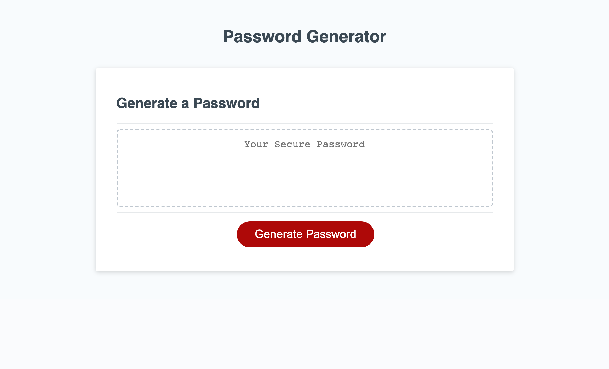

For this project I created a random password generator using JavaScript. When the page loads, the user is first instructed to click the "generate" button. Then, they must decide how many letter they want their password to be. If they choose an insufficient number, they are alerted to start over. If they choose a sufficient number, they continue on to answer 4 more questions that will set their preferences over which characters will be included in their password (uppercase letter, lowercase letters, numbers, and/or special characters). Using their preferences, the generator creates a random password for them. 

Live URL: https://isabellelew.github.io/Password-Generator/

